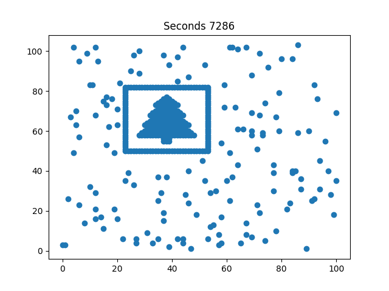

# Day 14 - Restroom Redoubt

## Part One

One of The Historians needs to use the bathroom;
fortunately, you know there's a bathroom near an unvisited location on their list,
and so you're all quickly teleported directly to
the lobby of Easter Bunny Headquarters.

Unfortunately, EBHQ seems to have **improved** bathroom security **again** after
your last [visit][aoc-2016-day2].
The area outside the bathroom is swarming with robots!

To get The Historian safely to the bathroom,
you'll need a way to predict where the robots will be in the future.
Fortunately,
they all seem to be moving on the tile floor in predictable **straight lines**.

You make a list (your puzzle input)
of all of the robots' current **positions** (`p`) and
**velocities** (`v`), one robot per line.

**For example:**

```plaintext
p=0,4 v=3,-3
p=6,3 v=-1,-3
p=10,3 v=-1,2
p=2,0 v=2,-1
p=0,0 v=1,3
p=3,0 v=-2,-2
p=7,6 v=-1,-3
p=3,0 v=-1,-2
p=9,3 v=2,3
p=7,3 v=-1,2
p=2,4 v=2,-3
p=9,5 v=-3,-3
```

Each robot's position is given as `p=x,y` where `x` represents
the number of tiles the robot is from the left wall and
`y` represents the number of tiles from the top wall (when viewed from above).
So, a position of `p=0,0` means the robot is all the way in the top-left corner.

Each robot's velocity is given as
`v=x,y` where `x` and `y` are given in **tiles per second**.
Positive `x` means the robot is moving to the **right**,
and positive `y` means the robot is moving **down**.
So, a velocity of `v=1,-2` means that each second,
the robot moves `1` tile to the right and `2` tiles up.

The robots outside the actual bathroom are in a space which
is `101` tiles wide and `103` tiles tall (when viewed from above).
However, in this example, the robots are in a space which
is only `11` tiles wide and `7` tiles tall.

The robots are good at navigating over/under each other
(due to a combination of springs, extendable legs, and quadcopters),
so they can share the same tile and don't interact with each other.
Visually,the number of robots on each tile in this example looks like this:

```plaintext
1.12.......
...........
...........
......11.11
1.1........
.........1.
.......1...
```

These robots have a unique feature for maximum bathroom security:
they can **teleport**.
When a robot would run into an edge of the space they're in,
they instead **teleport to the other side**, wrapping around the edges.
Here is what robot `p=2,4 v=2,-3` does for the first few seconds:

```plaintext
Initial state:
...........
...........
...........
...........
..1........
...........
...........

After 1 second:
...........
....1......
...........
...........
...........
...........
...........

After 2 seconds:
...........
...........
...........
...........
...........
......1....
...........

After 3 seconds:
...........
...........
........1..
...........
...........
...........
...........

After 4 seconds:
...........
...........
...........
...........
...........
...........
..........1

After 5 seconds:
...........
...........
...........
.1.........
...........
...........
...........
```

The Historian can't wait much longer,
so you don't have to simulate the robots for very long.
Where will the robots be after `100` seconds?

In the above example,
the number of robots on each tile after 100 seconds has elapsed looks like this:

```plaintext
......2..1.
...........
1..........
.11........
.....1.....
...12......
.1....1....
```

To determine the safest area,
count the **number of robots in each quadrant** after 100 seconds.
Robots that are exactly in the middle (horizontally or vertically)
don't count as being in any quadrant, so the only relevant robots are:

```plaintext
..... 2..1.
..... .....
1.... .....

..... .....
...12 .....
.1... 1....
```

In this example, the quadrants contain `1`, `3`, `4`, and `1` robot.
Multiplying these together gives a total **safety factor** of `**12**`.

Predict the motion of the robots in your list within
a space which is `101` tiles wide and `103` tiles tall.
**What will the safety factor be after exactly 100 seconds have elapsed?**

**Your puzzle answer was `PLACEHOLDER FOR VERIFIED INPUT ANSWER`**.

## Part Two

During the bathroom break,
someone notices that these robots seem awfully similar to
ones built and used at the North Pole.
If they're the same type of robots, they should have a hard-coded Easter egg:
very rarely, most of the robots should arrange themselves into
**a picture of a Christmas tree.**

**What is the fewest number of seconds that must elapse for**
**the robots to display the Easter egg?**

Your puzzle answer was *`7286`*.

**Both parts of this puzzle are complete!
They provide two gold stars: \*\***

At this point,
you should [return to your Advent calendar][aoc-calendar] and
try another puzzle.

If you still want to see it,
you can [get your puzzle input][aoc-day14-input].

## Notes

What an interesting puzzle!
I solved this one in two ways.
First I finally got to use my `Grid` and `Position` helper classes,
saved in a snippets file.
Second, the solution was somewhat interactive.

Turns out the generated puzzle input file was made so that
after a certain amount of iterations steps, or `seconds`,
the robots would arrange themselves into an image of a Christmas tree,
as seen below:



First I wanted to animate the `Grid.print` function and watch for it forming.
Problem is after about 2000 iterations I got worried it wasn't going to show.
So I did some analysis to see when the quadrants' robots would be most compact.
I could reuse the logic in part 1.
Then when it falls below a certain threshold I would interactively input with
a binary search iterative process,
I could find out when the robots would arrange themselves in their most compact form.
I found $1x10^8$ to be a good upper bound for the binary search.

Then with the interactive analysis done,
I can have the code in `analysis.py` print out the relative frequencies of each quadrant,
and crucially plot a scatter plot for each robot at the iteration step it occurs.
The figure above does indeed show itself.

Then finally,
going back to the solver code in `solver.py`,
setting the iterations to be a few frames before the expected Easter egg to come,
then waiting a few frames, it does indeed converge to that christmas tree.
I have the solver for part 2 simply hard-code the solution step when
the debug flag isn't given.

## Links

* [Advent of Code - 2023 - Calendar][aoc-calendar]
* [Advent of Code - Day 14 - Restroom Redoubt][aoc-day14]
* [Advent of Code - Day 14 - Input][aoc-day14-input]
* [Advent of Code - 2016 - Day 2 - Bathroom Security][aoc-2016-day2]

<!-- Hidden References -->
[aoc-calendar]: https://adventofcode.com/2024 "Advent of Code - Year/Calendar"
[aoc-day14]: https://adventofcode.com/2024/day/14 "Advent of Code - Day 14"
[aoc-day14-input]: https://adventofcode.com/2024/day/14/input "Advent of Code - Day 04 - Input"
[aoc-2016-day2]: https://adventofcode.com/2016/day/2 "Advent of Code - 2016 - Day 2 - Bathroom Security"
